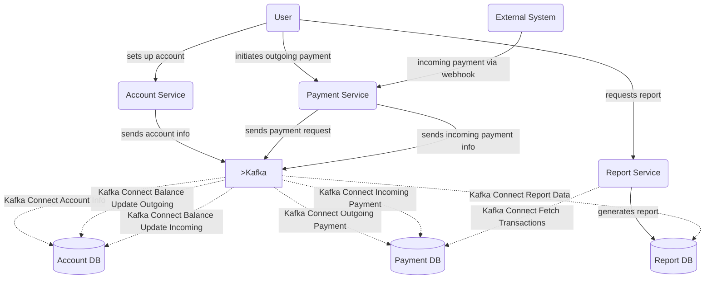

# BankPayment
Microservice project 

```mermaid
graph TD
    user(User) -->|sets up account| app_account(Account Service)
    app_account -->|sends account info| kafka[>Kafka] 
    kafka -.->|Kafka Connect Account Info| db_account[(Account DB)]


    user -->|initiates outgoing payment| app_payment(Payment Service)
    app_payment -->|sends payment request| kafka
    kafka -.->|Kafka Connect Outgoing Payment| db_payment[(Payment DB)]
    kafka -.->|Kafka Connect Balance Update Outgoing| db_account

    external(External System) -->|incoming payment via webhook| app_payment
    app_payment -->|sends incoming payment info| kafka
    kafka -.->|Kafka Connect Incoming Payment| db_payment
    kafka -.->|Kafka Connect Balance Update Incoming| db_account

    user -->|requests report| app_report(Report Service)
    app_report -.->|Kafka Connect Fetch Transactions| db_payment
    app_report -->|generates report| db_report[(Report DB)]

    kafka -.->|Kafka Connect Report Data| db_report

```
 